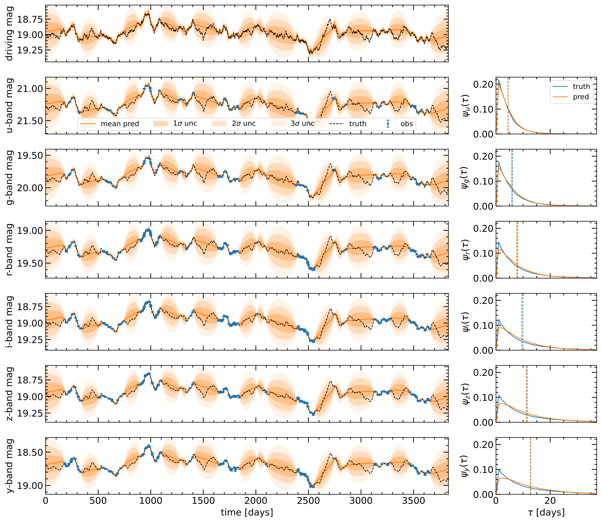
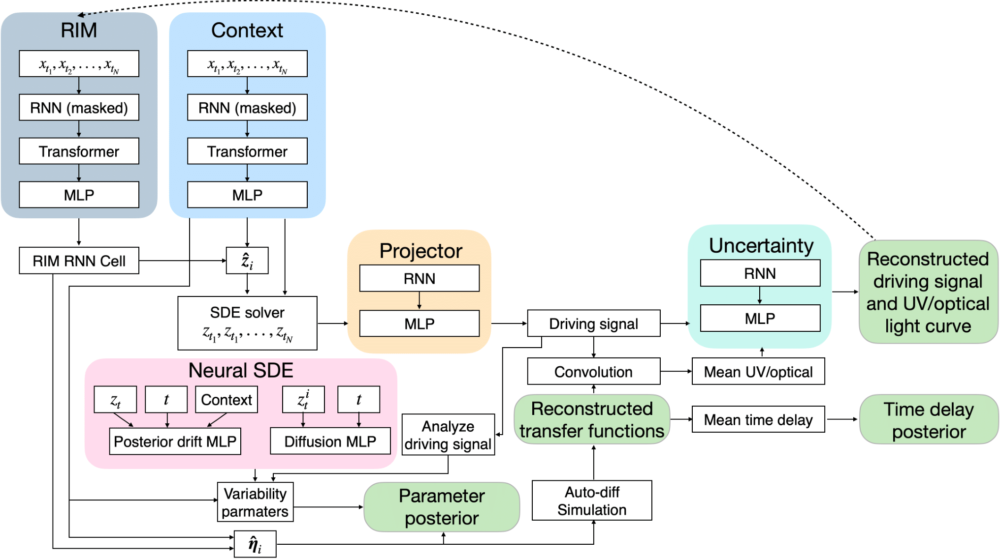

# Joint Modeling of Quasar Variability and Accretion Disk Reprocessing using Latent SDEs

Code for "Joint Modeling of Quasar Variability and Accretion Disk Reprocessing using Latent Stochastic Differential Equations" [[arXiv]](https://arxiv.org/abs/2410.18423). 

<p align="center">
  
</p>

## Background

[Quasars](https://en.wikipedia.org/wiki/Quasar) are bright [AGN](https://en.wikipedia.org/wiki/Active_galactic_nucleus) powered by [super massive black holes (SMBH)](https://en.wikipedia.org/wiki/Supermassive_black_hole) at the center of galaxies. Their UV/optical variability is often modeled by an X-ray driving source at the corona above the SMBH that is reprocessed by the accretion disk. This reprocessing introduces wavelength dependent time lags, modeled by the convolution of the driving signal and the so-called transfer function kernels that contain the physics of the reprocessing. Here we design a [neural network](https://en.wikipedia.org/wiki/Neural_network_(machine_learning)) that incorporates the physics of this reprocessing in its architecture. The driving signal is reconstructed as a latent [stochastic differential equation (SDE)](https://en.wikipedia.org/wiki/Stochastic_differential_equation), a type of physically motivated generative deep learning technique. The transfer functions are modeled through an auto-differentiable accretion disk model and included directly into the neural network. The reconstructed driving signal and transfer functions are convolved to best reconstruct the observed UV/optical variability, including at unobserved times. In addition, we reconstruct the accretion disk/black hole parameters, parameters of the driving signal, and time delays between wavebands. We also use a recurrent inference machine to iteratively improve these predictions.

We use simulated ten year quasar [light curves](https://en.wikipedia.org/wiki/Light_curve) across six different bandpasses (*ugrizy*) in preparation for the [Rubin Observatory Legacy Survey of Space and Time (LSST)](https://en.wikipedia.org/wiki/Vera_C._Rubin_Observatory). Simulated LSST observations and photometric errors are included using [rubin_sim](https://github.com/lsst/rubin_sim). We show our method outperforms a Gaussian process regression baseline at reconstructing quasar light curves, including with out-of-distribution driving signals. Furthermore, our model can predict the broken power-law power spectrum parameters of the driving signal and the physical parameters of the accretion disk such as the black hole mass, Eddington ratio, temperature slope, and redshift, even for the out-of-distribution driving signals. 

<p align="center">
  
</p>

## Citation

If you found this codebase useful in your research, please consider citing:

```
@misc{fagin2024jointmodelingquasarvariability,
      title={Joint Modeling of Quasar Variability and Accretion Disk Reprocessing using Latent Stochastic Differential Equations}, 
      author={Joshua Fagin and James Hung-Hsu Chan and Henry Best and Matthew O'Dowd and K. E. Saavik Ford and Matthew J. Graham and Ji Won Park and V. Ashley Villar},
      year={2024},
      eprint={2410.18423},
      archivePrefix={arXiv},
      primaryClass={astro-ph.GA},
      url={https://arxiv.org/abs/2410.18423}, 
}
```
You may also concider citing an earlier version of this research:

```
@article{Fagin_2024,
doi = {10.3847/1538-4357/ad2988},
url = {https://dx.doi.org/10.3847/1538-4357/ad2988},
year = {2024},
month = {apr},
publisher = {The American Astronomical Society},
volume = {965},
number = {2},
pages = {104},
author = {Joshua Fagin and Ji Won Park and Henry Best and James H. H. Chan and K. E. Saavik Ford and Matthew J. Graham and V. Ashley Villar and Shirley Ho and Matthew O’Dowd},
title = {Latent Stochastic Differential Equations for Modeling Quasar Variability and Inferring Black Hole Properties},
journal = {The Astrophysical Journal},
}
```

### Contact
For inquiries or to request the rest of the LSST cadence files or trained model, reach out to: jfagin@gradcenter.cuny.edu

### See also a more general version of latent SDEs in:

https://iopscience.iop.org/article/10.3847/1538-4357/ad2988

https://github.com/JFagin/latent_SDE

### References
- Joshua Fagin, James Hung-Hsu Chan, Henry Best, Matthew O'Dowd, K. E. Saavik Ford, Matthew J. Graham, Ji Won Park, V. Ashley Villar. "Joint Modeling of Quasar Variability and Accretion Disk Reprocessing using Latent Stochastic Differential Equations". 2025. [[arXiv]](https://arxiv.org/abs/2410.18423)
- Joshua Fagin, Ji Won Park, Henry Best, James Hung-Hsu Chan, K.E Saavik Ford, Matthew J. Graham, V. Ashley Villar, Shirley Ho, Matthew O'Dowd. "Latent Stochastic Differential Equations for Modeling Quasar Variability and Inferring Black Hole Properties". 2024. [[arXiv]](https://arxiv.org/abs/2304.04277) 
- Xuechen Li, Ting-Kam Leonard Wong, Ricky T. Q. Chen, David Duvenaud. "Scalable Gradients for Stochastic Differential Equations". *International Conference on Artificial Intelligence and Statistics.* 2020. [[arXiv]](https://arxiv.org/pdf/2001.01328.pdf)
- Zhengping Che, Sanjay Purushotham, Kyunghyun Cho, David Sontag, Yan Liu. "Recurrent Neural Networks for Multivariate Time Series with Missing Values
". *Nature.* 2018. [[arXiv]](https://arxiv.org/pdf/2001.01328.pdf)
- Patrick Putzky, Max Welling. "Recurrent Inference Machines for Solving Inverse Problems". 2017. [[arXiv]](https://arxiv.org/abs/1706.04008)
